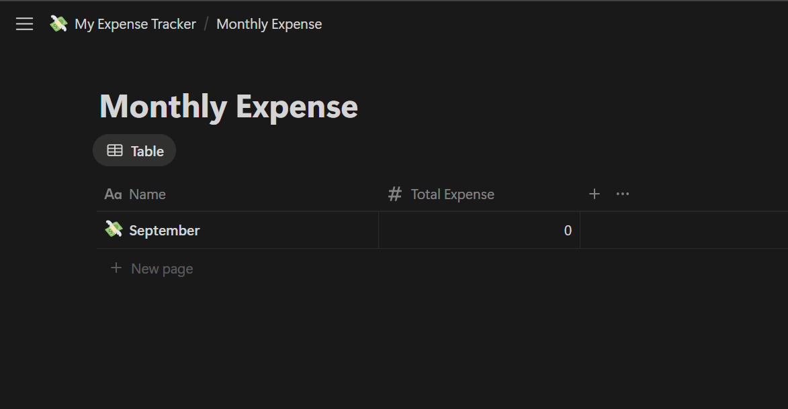
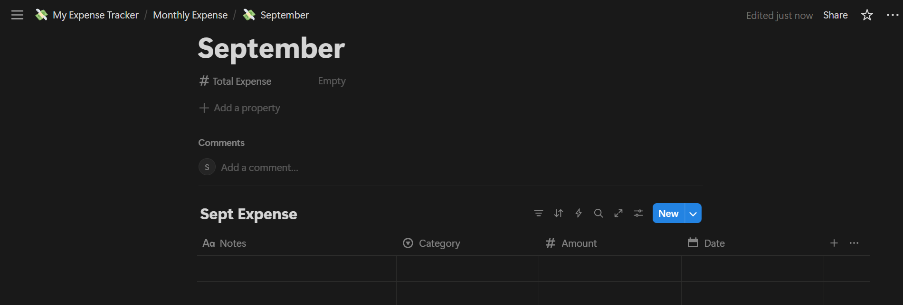

# 🧾 Monthly Expense Tracker

A simple **Python + Notion API** project to track daily expenses and maintain a monthly total.  
This tool helps you record expenses into Notion with proper categorization while also keeping a **running monthly summary**.

## 🚀 Features
- Add daily expenses with:
  - Notes
  - Category
  - Amount
  - Date
- Store expenses in **Notion Daily Expense Database**.
- Automatically update the **Monthly Summary Database** with total expenses.
- Validate inputs (month, amount, date).
- Environment-based configuration (secure with `.env`).

## 🏗️ How It Works
1. **User runs script** → Enters expense details (month, notes, category, amount, date).
2. **Daily Database** → A new row is created for that expense.
3. **Monthly Database** → The script fetches current total, adds the new expense, and updates it.

## ⚙️ Setup

1. Clone this repo  
  - git clone https://github.com/Saumya-Jha-07/Expense-Tracker-Notion.git
  - cd monthly-expense-tracker
  - Create a .env file with:

2. Install Dependencies
  - pip install requests python-dotenv

3. Configure Notion
  - Create a database for each month (e.g., September 2025).
  - Create another database for all months summary (to store monthly totals).
  - Add these properties in each DB:
    ## 1. 📘 Monthly Summary Database
    
    ## 2. 📘 Daily Expense Database
    
        

4. Setup Environment Variables
  - Create a .env file:
  - NOTION_TOKEN=your_notion_token
  - all_month_db_id=xxxxxxxxxxxxxxxxxxxxxxxxxxxxxxxx
  - september_2025_db_id=xxxxxxxxxxxxxxxxxxxxxxxxxxxxxxxx
  - october_2025_db_id=xxxxxxxxxxxxxxxxxxxxxxxxxxxxxxxx
  - add more months as needed ...

5. ▶️ Usage
  - Run the script: python main.py

📝 Example Usage

Enter the month (1-12): 9
Enter the notes : Bought Groceries
Enter the category : Food
Enter amount : 200
Enter the date in yyyy-mm-dd format (leave blank for today):
✅ Added Expense to september month: Food - 200 - 2025-09-01
✅ Updated september's total expense from 500 to 700

💡 # Problem It Solves
Managing personal expenses is often scattered across notes, Excel sheets, or just forgotten.
This project solves that by:
Centralizing expenses in Notion, where they are easy to view and analyze.
Automatically updating monthly totals when you log a new expense.
Keeping the workflow simple — just run a script and input your expense details.

🔮 ## Future Roadmap

Currently, this project is designed for personal use with a CLI interface and direct integration with Notion.
But the vision is to evolve it into a full-fledged multi-user web application.

🥅 Short-Term Goals (1–2 months)

Add view functionality: query expenses by category, date, or month.
Export expenses to CSV/Excel for easy analysis.
Improve error handling and logging.
Add support for auto-creating monthly DBs if not found in Notion.

🚀 Mid-Term Goals (3–6 months)

Build a web dashboard for expense tracking.
Multi-user authentication system.
Support both:
  Notion sync (for users who want to connect Notion DBs).
  Standalone DB (PostgreSQL/MySQL/SQLite) for those who don’t use Notion.
Add charts & analytics (monthly breakdown, category-wise distribution).

🌍 Long-Term Goals (6–12 months)

User settings for choosing:
Primary storage → Notion / Web DB / Both
Add AI-powered insights (e.g., “You’re overspending on Food this month”).
Add budgeting features (set limits, alerts when close to limit).
Community features (optional): share expense trends with family/friends.

So the journey is: CLI → Web App → Multi-user platform with analytics.

🤝 Contributing
This is a personal project, but contributions and suggestions are welcome!
